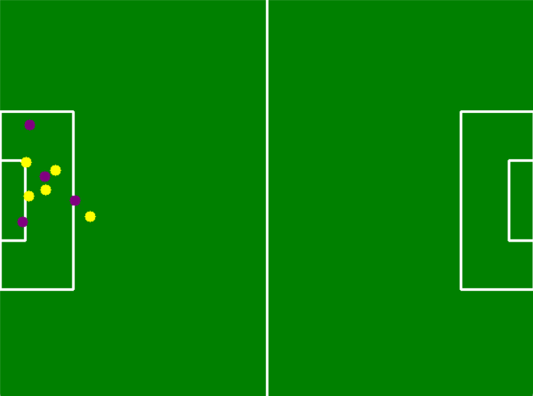

# サッカー仮想戦術ボード (Soccer Virtual Tactics Board)

## 概要
YOLOv8 を用いてサッカーの試合映像から選手・ボールを検出し，
射影変換によって仮想戦術ボード上にプロットするシステムです。

従来の戦術ボードと異なり，実際の試合映像とリンクした戦術の「見える化」が可能です。

## 特徴
- 選手とボールを自動検出（YOLOv8）
- チームごとの色分け表示
- 仮想フィールドへの射影変換
- ハーフライン，ゴールエリア，ペナルティエリア，センターサークルを描画
- 選手アイコンを自由に操作可能

例： ![仮想戦術ボード(結果.png)

## 環境
- Python 3.10+
- OpenCV
- Ultralytics YOLOv8
- NumPy

## 🔬 研究方法
1. **データ作成**  
   - 試合映像からフレームを抽出  
   - labelImg を用いて選手・ボールをラベル付け  
   - YOLOv8 学習用のアノテーションデータを作成  

2. **物体検出**  
   - YOLOv8 を学習  
   - 学習済みモデルを映像に適用し，選手とボールを検出  
   - 座標データを取得  

3. **仮想戦術ボード作成**  
   - コートの縦横比を設定し，フィールドを描画  
   - ハーフライン，ゴールエリア，ペナルティエリア，センターサークルなどを追加  

4. **射影変換とプロット**  
   - 映像から基準点を4点選び射影変換を計算  
   - 選手・ボールの座標を仮想戦術ボードにプロット  

## 📊 進捗状況
- バルセロナ／ドルトムントのチームごとに色分けした物体検出に成功  
- 動画中の選手を正しく検出・分類できていることを確認  
- 仮想戦術ボードに細かい白線を追加し，視認性を向上  
- ゴールキーパー専用アノテーションの作業を進行中  

## 🚀 今後の展望
- ゴールキーパーの専用アノテーションの精度向上  
- 動画全体を通したフォーメーション変化の自動抽出  
- 戦術ボード上でのシミュレーション機能の追加  
- Webアプリ化による誰でも利用可能なインターフェースの実現  
